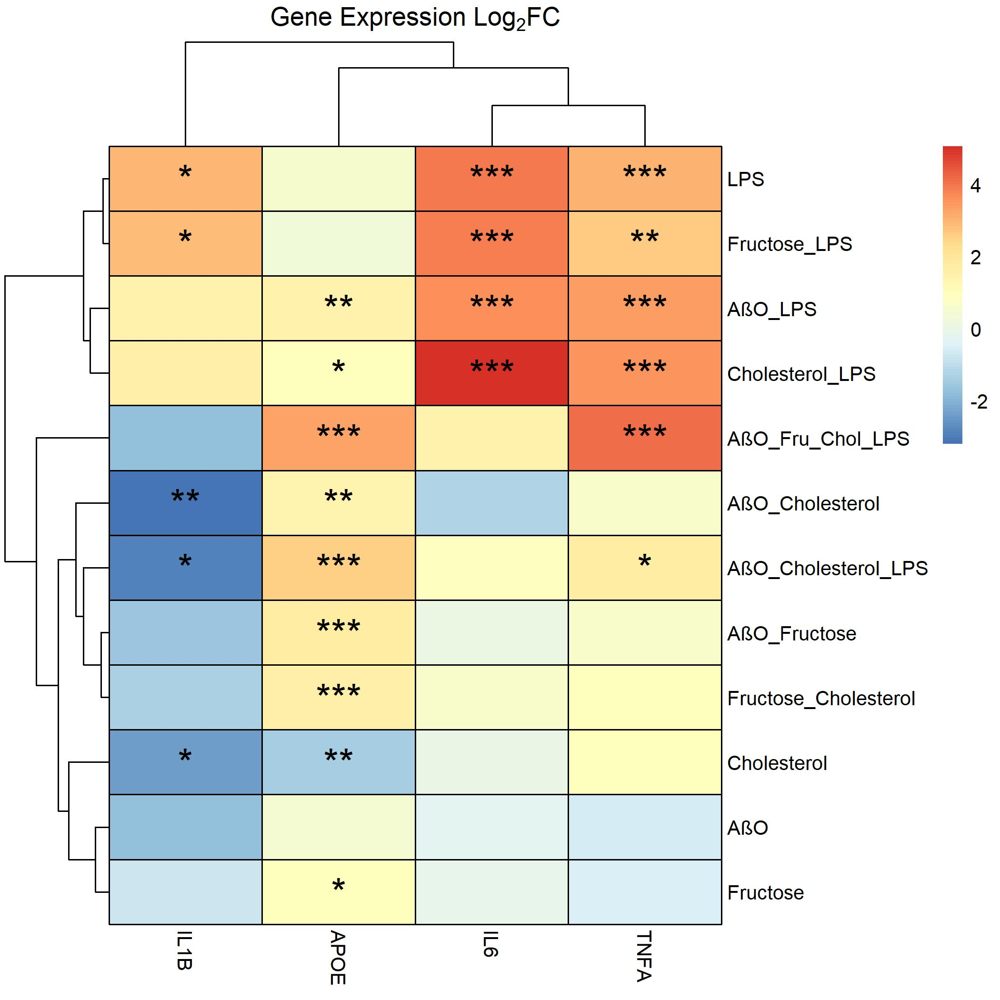

```{r include = F}
## Packages
if(!any(rownames(installed.packages()) == "pacman")){
   install.packages("pacman")
}

pacman::p_load(here,
               pheatmap,
               tidyverse,
               ggthemes,
               forcats, # Rename levels
               emmeans,
               ggpubr,
               DT,
               egg,
               patchwork) 

data <- read.csv(here("tidy","qpcr_hmc3.csv"))

data_summary <- data %>%
        group_by(treatment) %>%
        summarize(IL1B = log2(mean(IL1B, na.rm = TRUE)),
                  IL6 = log2(mean(IL6, na.rm = TRUE)),
                  TNFA = log2(mean(TNFA, na.rm = TRUE)),
                  APOE = log2(mean(APOE, na.rm = TRUE)),
                  CD33 = log2(mean(CD33, na.rm = TRUE)),
                  ST6GALNAC3 = log2(mean(ST6GALNAC3, na.rm = TRUE)),
                  TREM2 = log2(mean(TREM2, na.rm = TRUE))) %>%
        filter(!(treatment == "control"))

```


## Heatmap
```{r echo = F, warning = F}
data_summary_df <- as.data.frame(data_summary) %>%
        subset(select = -c(CD33, ST6GALNAC3, TREM2))

## As Factor and reoder, and assign name rename
data_summary_df$treatment <- factor(data_summary_df$treatment, levels = c("abo", "cho", "fru","lps", "abo_cho","abo_fru", "abo_lps", "cho_lps", "fru_cho","fru_lps", "abo_cho_lps","abo_fru_cho_lps"))

## New Dataframe reordered
data_summary_df_reorder <- data_summary_df[order(data_summary_df$treatment), ]

## Assign Names to Levels
levels(data_summary_df_reorder$treatment) <- list(AβO = "abo",
                                                     Cholesterol = "cho",
                                                     Fructose = "fru",
                                                     LPS = "lps",
                                                     AβO_Cholesterol = "abo_cho",
                                                     AβO_Fructose = "abo_fru",
                                                     AβO_LPS = "abo_lps",
                                                     Cholesterol_LPS = "cho_lps",
                                                     Fructose_Cholesterol = "fru_cho",
                                                     Fructose_LPS = "fru_lps",
                                                     AβO_Cholesterol_LPS = "abo_cho_lps",
                                                     AβO_Fru_Chol_LPS = "abo_fru_cho_lps")


rownames(data_summary_df_reorder) <- data_summary_df_reorder$treatment


data_summary_df_reorder$treatment <- NULL

pheatmap(data_summary_df_reorder, main = expression("Gene Expression "*Log[2]*"FC"),  display_numbers = TRUE,
         border_color = "black",
         number_color = "black", filename = here("figures","qPCR","heatmap_new.jpg"))

pheatmap(data_summary_df_reorder, main = expression("Gene Expression "*Log[2]*"FC"),  display_numbers = TRUE,
         border_color = "black",
         number_color = "black")
```




```{r include = F}
## Run first before qPCR Barplot
## Log2 Transform - Remove to not use
data <- data %>%
        subset(select = -c(CD33, ST6GALNAC3, TREM2)) %>%
  mutate(IL1B = log2(IL1B),
         IL6 = log2(IL6),
         TNFA = log2(TNFA),
         APOE = log2(APOE)) 
```


```{r include = F}

## Rename Factors

data$treatment <- factor(data$treatment, levels = c("control","abo", "cho", "fru","lps", "abo_cho","abo_fru", "abo_lps", "cho_lps", "fru_cho","fru_lps", "abo_cho_lps","abo_fru_cho_lps"))

## New Dataframe reordered
data <- data[order(data$treatment), ]

## Assign Names to Levels
levels(data$treatment) <- list(Control = "control",
                               AβO = "abo",
                               Cholesterol = "cho",
                               Fructose = "fru",
                               LPS = "lps",
                               AβO_Cholesterol = "abo_cho",
                               AβO_Fructose = "abo_fru",
                               AβO_LPS = "abo_lps",
                               Cholesterol_LPS = "cho_lps",
                               Fructose_Cholesterol = "fru_cho",
                               Fructose_LPS = "fru_lps",
                               AβO_Cholesterol_LPS = "abo_cho_lps",
                               AβO_Fru_Chol_LPS = "abo_fru_cho_lps")


```

***


## IL1B {.tabset .tabset-pills}

### IL1B Plot 
```{r echo = F, fig.dim = c(18, 14)}
anova <- aov(IL1B ~ treatment, data = data)
p_value <- signif(summary(anova)[[1]][["Pr(>F)"]][1],3)

# Contrast with Dunnett
emm_contrasts <- anova %>%
  emmeans("treatment") %>%
  contrast("trt.vs.ctrl", infer = c(TRUE, TRUE)) %>%
  as_tibble() %>%
  mutate(p.value.round = insight::format_p(p.value, name = NULL,),
         p.value.star = insight::format_p(p.value, name = NULL, stars_only = TRUE)) 

emm_contrasts_split <- emm_contrasts
## Split string
emm_contrasts_split[c('group1', 'group2')] <- str_split_fixed(emm_contrasts_split$contrast, ' - ', 2) 

## Data Summary ##
dt <- data %>%
  group_by(treatment) %>%
        summarize(mean = mean(IL1B),
                  sd = sd(IL1B))

IL1B_plot <- ggplot(dt, aes(treatment, mean)) + 
        geom_bar(stat = "identity", aes(fill = mean), show.legend = FALSE) +
        geom_errorbar(aes(ymin = mean-sd, ymax=mean+sd), width = 0.2) +
        labs(x = "Treatment", y = expression(Log[2]*"FC"), title = "IL1B", subtitle = paste("ANOVA: P","=", paste0(p_value, collapse = NULL))) +
        theme_classic() +
        theme(axis.text.x = element_text(angle = 90, color = "black")) +
  scale_fill_continuous(high = "#132B43", low = "#56B1F7") +
        # letters
stat_pvalue_manual(data = emm_contrasts_split,
                   y.position = rep(5,12),
                   label = "p.value.star",
                   x = "group1",
                   vjust = 2,
                   remove.bracket=TRUE,
                   size = 12) +
        theme_classic() +
        theme(axis.text = element_text(angle = 90, color = "black"),
              text = element_text(size = 23))

IL1B_plot

ggsave(here("figures","qPCR","IL1B_dunnett.jpg"), dpi = 300, width = 10, height = 10)
```

***

### IL1B Stats
```{r echo = F}
datatable(as.data.frame(emm_contrasts), colnames = c("Contrast", "Mean Diff", "SE", "DF"," Lower CI 95%", "Upper CI 95%","T.ratio","P.adjusted","P.rounded","Sig Level"))

datatable(dt, colnames = c("Treatment","Mean","Standard Deviation (SD)")) %>%
        formatRound(columns = c("mean","sd"), digits = 2)


```

***

## IL6 Plot {.tabset .tabset-pills}

### IL6 Plot 

```{r echo = F, fig.dim = c(18, 14)}
anova <- aov(IL6 ~ treatment, data = data)
p_value <- signif(summary(anova)[[1]][["Pr(>F)"]][1],3)

# Contrast with Dunnett
emm_contrasts <- anova %>%
  emmeans("treatment") %>%
  contrast("trt.vs.ctrl", infer = c(TRUE, TRUE)) %>%
  as_tibble() %>%
  mutate(p.value.round = insight::format_p(p.value, name = NULL,),
         p.value.star = insight::format_p(p.value, name = NULL, stars_only = TRUE)) 

emm_contrasts_split <- emm_contrasts
## Split string
emm_contrasts_split[c('group1', 'group2')] <- str_split_fixed(emm_contrasts_split$contrast, ' - ', 2) 

## Data Summary ##
dt <- data %>%
  group_by(treatment) %>%
        summarize(mean = mean(IL6),
                  sd = sd(IL6))

IL6_plot <- ggplot(dt, aes(treatment, mean)) + 
        geom_bar(stat = "identity", aes(fill = mean), show.legend = FALSE) +
        geom_errorbar(aes(ymin = mean-sd, ymax=mean + sd), width = 0.2) +
        
        labs(x = "Treatment", y = expression(Log[2]*"FC"), title = "IL6", subtitle = paste("ANOVA: P","=", paste0(p_value, collapse = NULL))) +
        theme_classic() +
        theme(axis.text.x = element_text(angle = 90, color = "black")) +
  scale_fill_continuous(high = "#132B43", low = "#56B1F7") +
        # letters
stat_pvalue_manual(data = emm_contrasts_split,
                   y.position = rep(7,12),
                   label = "p.value.star",
                   x = "group1",
                   vjust = 2,
                   remove.bracket=TRUE,
                   size = 12) +
        theme_classic() +
        theme(axis.text = element_text(angle = 90, color = "black"),
              text = element_text(size = 25)) 

IL6_plot

ggsave(here("figures","qPCR","IL6_dunnett.jpg"), dpi = 300, width = 10, height = 10)
```

### IL6 Stats
```{r echo = F}
datatable(as.data.frame(emm_contrasts), colnames = c("Contrast", "Mean Diff", "SE", "DF"," Lower CI 95%", "Upper CI 95%","T.ratio","P.adjusted","P.rounded","Sig Level"))

datatable(dt, colnames = c("Treatment","Mean","Standard Deviation (SD)")) %>%
        formatRound(columns = c("mean","sd"), digits = 2)
```

***

## TNFa {.tabset .tabset-pills}

### TNFa 
```{r echo = F, fig.dim = c(18, 14)}

### TNFA
anova <- aov(TNFA ~ treatment, data = data)
p_value <- signif(summary(anova)[[1]][["Pr(>F)"]][1],3)

# Contrast with Dunnett
emm_contrasts <- anova %>%
  emmeans("treatment") %>%
  contrast("trt.vs.ctrl", infer = c(TRUE, TRUE)) %>%
  as_tibble() %>%
  mutate(p.value.round = insight::format_p(p.value, name = NULL,),
         p.value.star = insight::format_p(p.value, name = NULL, stars_only = TRUE)) 

emm_contrasts_split <- emm_contrasts
## Split string
emm_contrasts_split[c('group1', 'group2')] <- str_split_fixed(emm_contrasts_split$contrast, ' - ', 2) 

## Data Summary ##
dt <- data %>%
  group_by(treatment) %>%
        summarize(mean = mean(TNFA),
                  sd = sd(TNFA))


TNFA_plot <- ggplot(dt, aes(treatment, mean)) + 
        geom_bar(stat = "identity", aes(fill = mean), show.legend = FALSE) +
        geom_errorbar(aes(ymin = mean-sd, ymax=mean + sd), width = 0.2) +
        labs(x = "Treatment", y = expression(Log[2]*"FC"), title = "TNFA", subtitle = paste("ANOVA: P","=", paste0(p_value, collapse = NULL))) +
        theme_classic() +
        theme(axis.text.x = element_text(angle = 90, color = "black")) +
  scale_fill_continuous(high = "#132B43", low = "#56B1F7") +
        
stat_pvalue_manual(data = emm_contrasts_split,
                   y.position = rep(7,12),
                   label = "p.value.star",
                   x = "group1",
                   vjust = 2,
                   remove.bracket=TRUE,
                   size = 12) +
        theme_classic() +
        theme(axis.text = element_text(angle = 90, color = "black"),
              text = element_text(size = 25)) 

TNFA_plot

ggsave(here("figures","qPCR","TNFa_dunnett.jpg"), dpi = 300, width = 10, height = 10)
```

### TNFa Stats
```{r echo = F}
datatable(as.data.frame(emm_contrasts), colnames = c("Contrast", "Mean Diff", "SE", "DF"," Lower CI 95%", "Upper CI 95%","T.ratio","P.adjusted","P.rounded","Sig Level"))

datatable(dt, colnames = c("Treatment","Mean","Standard Deviation (SD)")) %>%
        formatRound(columns = c("mean","sd"), digits = 2)
```


***

## APOE {.tabset .tabset-pills}

### APOE Plot
```{r echo = F, fig.dim = c(18, 14)}
### APOE
anova <- aov(APOE ~ treatment, data = data)
p_value <- signif(summary(anova)[[1]][["Pr(>F)"]][1],3)

# Contrast with Dunnett
emm_contrasts <- anova %>%
  emmeans("treatment") %>%
  contrast("trt.vs.ctrl", infer = c(TRUE, TRUE)) %>%
  as_tibble() %>%
  mutate(p.value.round = insight::format_p(p.value, name = NULL,),
         p.value.star = insight::format_p(p.value, name = NULL, stars_only = TRUE)) 

emm_contrasts_split <- emm_contrasts
## Split string
emm_contrasts_split[c('group1', 'group2')] <- str_split_fixed(emm_contrasts_split$contrast, ' - ', 2) 

## Data Summary ##
dt <- data %>%
  group_by(treatment) %>%
        summarize(mean = mean(APOE),
                  sd = sd(APOE))


APOE_plot <- ggplot(dt, aes(treatment, mean)) + 
        geom_bar(stat = "identity", aes(fill = mean), show.legend = FALSE) +
        geom_errorbar(aes(ymin = mean-sd, ymax=mean + sd), width = 0.2) +
        labs(x = "Treatment", y = expression(Log[2]*"FC"), title = "APOE", subtitle = paste("ANOVA: P","=", paste0(p_value, collapse = NULL))) +
        theme_classic() +
        theme(axis.text.x = element_text(angle = 90, color = "black")) +
  scale_fill_continuous(high = "#132B43", low = "#56B1F7") +
        stat_pvalue_manual(data = emm_contrasts_split,
                   y.position = rep(5,12),
                   label = "p.value.star",
                   x = "group1",
                   vjust = 2,
                   remove.bracket=TRUE,
                   size = 12) +
        theme_classic() +
        theme(axis.text = element_text(angle = 90, color = "black"),
              text = element_text(size = 25)) 

APOE_plot

ggsave(here("figures","qPCR","APOE_dunnett.jpg"), dpi = 300, width = 10, height = 10)
```

### APOE Stats
```{r echo = F}
datatable(as.data.frame(emm_contrasts), colnames = c("Contrast", "Mean Diff", "SE", "DF"," Lower CI 95%", "Upper CI 95%","T.ratio","P.adjusted","P.rounded","Sig Level"))

datatable(dt, colnames = c("Treatment","Mean","Standard Deviation (SD)")) %>%
        formatRound(columns = c("mean","sd"), digits = 2)
```


***

## Combine Images
```{r echo = F, fig.dim = c(18, 14)}

patchwork = IL1B_plot + IL6_plot + TNFA_plot + APOE_plot

# Remove title from second subplot
patchwork[[1]] = patchwork[[1]] + theme(axis.title.x = element_blank(),
                                     axis.text.x = element_blank())

patchwork[[2]] = patchwork[[2]] + theme(axis.title.x = element_blank(),
                                    axis.text.x = element_blank(),
                                    axis.ticks.y = element_blank(),
                                    axis.title.y = element_blank())

# Remove title from third subplot
patchwork[[4]] = patchwork[[4]] + theme(axis.title.y = element_blank() )

patchwork + plot_annotation(tag_levels = "A")

ggsave(here("figures","qPCR","combine_qPCR_dunnett.jpg"), dpi = 300, width = 18, height = 14)
```


